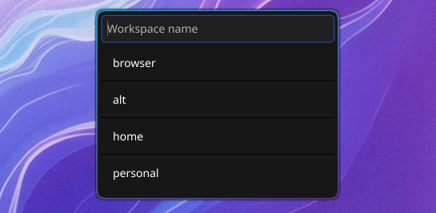

# hyprdyn



Hyprdyn is a dynamic named workspace utility for Hyprland, loosely inspired by XMonad DynamicWorkspaces.

#### Features:

- Spawn workspaces by name.
- Swap to workspaces by name.
- Rename workspaces.
- Send a window to a workspace by name. (shift-[enter/return] to follow window.)
- Auto-completion with tab selection. (shift-tab reverse)
- Switch to or spawn primary workspace. (config req.)
- Per monitor default workspaces (config req.)
- Auto-close on focus loss to stay out of the way.

#### Usage

```bash
Usage of hyprdyn:
  -primary
    	Go to, or spawn your primary workspace. See config:primaryName
  -rename
    	Rename a workspace.
  -select
    	Select or create a workspace on current monitor.
  -send
    	Send the current window to a workspace.
  -setup
    	Set configured monitors default workspace names. Useful on startup ie. ('exec-once')
```

#### Example Hyprland Config

Note: This is **my** config and I use weird keyboards so YMMV. Customizing bindings to your preference is recommended.

```
# Setup workspaces on start
exec-once = hyprdyn -setup

# bindings
bind = $mainMod SHIFT, H, exec, hyprdyn -primary
bind = $mainMod SHIFT, S, exec, hyprdyn -send
bind = $mainMod, S, exec, hyprdyn -select
bind = $mainMod, R, exec, hyprdyn -rename

# Window position center
windowrule {
    name = hyprdyn_rule
    float = on
    center = on
    match:class = hyprdyn
}
```

#### Configuring Hyprdyn

Simple json config: `$HOME/.config/hyprdyn.json`

```json
{
  "primaryName": "home",
  "monitors": [
    {
      "id": "DP-1",
      "defaultName": "browser"
    },
    {
      "id": "DP-2",
      "defaultName": "alt"
    },
    {
      "id": "DP-3",
      "defaultName": "home"
    }
  ],
  "autoComplete": ["dev", "term", "browser", "development", "news", "personal"]
}
```

- `primaryName`: Primary / default workspace name for quick access. With `-primary` flag, switch to this workspace or spawn on the active monitor.
- `Monitors`: Default workspace names per monitor output.
- `autoComplete`: Additional auto-completions aside from existing workspaces, active when a search term is typed using `-select` or `-send`.

#### Building Hyprdyn

Requirements:

- go 1.19+
- gcc
- [Fyne](https://docs.fyne.io/started/quick/#prerequisites)

```sh
go mod download

make clean build
```

#### Installing Hyprdyn

```sh
make clean build install
```
