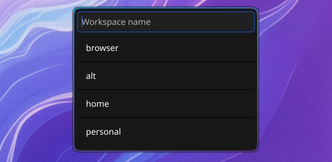

# hyprdyn



Hyprdyn is a dynamic named workspace utility for Hyprland, loosely inspired by XMonad DynamicWorkspaces.

#### Features

- Spawn workspaces by name.
- Swap to workspaces by name.
- Rename workspaces.
- Send a window to a workspace by name. (shift-[enter/return] to follow window.)
- Auto-completion with tab selection. (shift-tab reverse)
- Switch to or spawn primary workspace. (config req.)
- Per monitor default workspaces (config req.)
- Auto-close on focus loss to stay out of the way.
- Theme configuration. (pre-defined or custom theming)

#### Usage

```bash
Usage of hyprdyn:
  -primary
     Go to, or spawn your primary workspace. See config:primaryName
  -rename
     Rename a workspace.
  -select
     Select or create a workspace on current monitor.
  -send
     Send the current window to a workspace.
  -setup
     Set configured monitors default workspace names. Useful on startup ie. ('exec-once')
```

#### Example Hyprland Config

Note: Use version tag 1.0.0 for hyprlang / hyprland 0.56.x and lesser versions.

Note: This is **my** config and I use weird keyboards so YMMV. Customizing bindings to your preference is recommended.

```lua
-- Setup workspaces on start
hl.exec_cmd("hyprdyn --setup")

-- bindings
hl.bind(mainMod .. " + SHIFT + H", hl.dsp.exec_cmd("hyprdyn --primary"))
hl.bind(mainMod .. " + SHIFT + S", hl.dsp.exec_cmd("hyprdyn --send"))
hl.bind(mainMod .. " + S", hl.dsp.exec_cmd("hyprdyn --select"))
hl.bind(mainMod .. " + R", hl.dsp.exec_cmd("hyprdyn --rename"))

-- Window position center
hl.window_rule({
    name = "hyprdyn_rule",
    match = {
        class = "hyprdyn",
    },
    float = true,
    center = true,
})
```

#### Configuring Hyprdyn

Simple json config: `$HOME/.config/hyprdyn/config.json`

Note: If `theme` is present it will override any `customTheme` defined.

```json
{
  "primaryName": "home",
  "monitors": [
    {
      "id": "DP-1",
      "defaultName": "browser"
    },
    {
      "id": "DP-2",
      "defaultName": "alt"
    },
    {
      "id": "DP-3",
      "defaultName": "home"
    }
  ],
  "autoComplete": ["dev", "term", "browser", "development", "news", "personal"],
  "theme": "default",
  "customTheme": {
    "background": "#272822",
    "inputBackground": "#1E1F1C",
    "inputBorder": "#49483E",
    "placeholder": "#75715E",
    "listSeparator": "#3E3D32",
    "text": "#F8F8F2",
    "newText": "#A6E22E",
    "newHighLight": "#F92672",
    "highlight": "#E6DB74",
    "suggestion": "#66D9EF",
    "disabledText": "#75715E"
  }
}
```

- `primaryName`: Primary / default workspace name for quick access. With `-primary` flag, switch to this workspace or spawn on the active monitor.
- `Monitors`: Default workspace names per monitor output.
- `autoComplete`: Additional auto-completions aside from existing workspaces, active when a search term is typed using `-select` or `-send`.
- `theme`: Built in themes by name. Overrides `customTheme` if defined.
  - One of: (default emerald cyber nordly ruby snow darksky ocean)
- `customTheme`: Theme each component of the ui with hex colors. Must be in the format `#FFFFFF`.

#### Building Hyprdyn

Requirements:

- go 1.25+
- gcc
- [Fyne](https://docs.fyne.io/started/quick/#prerequisites)

```sh
go mod download

make clean build
```

#### Installing Hyprdyn

Default install location: `/usr/bin/hyprdyn`

```sh
make clean build install
```
